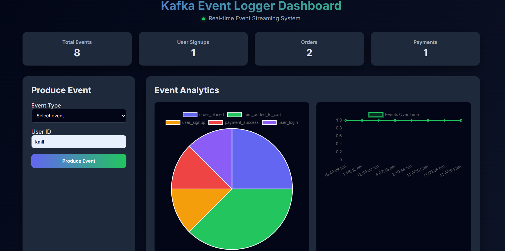
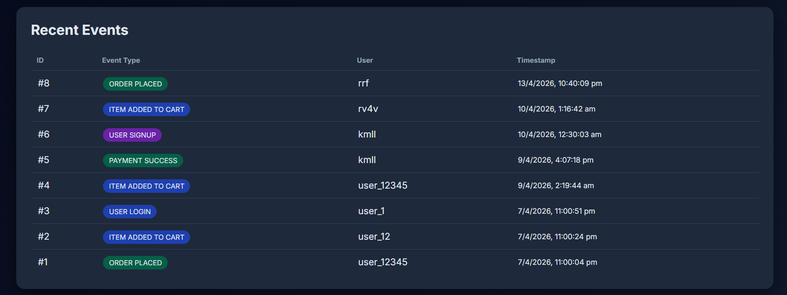
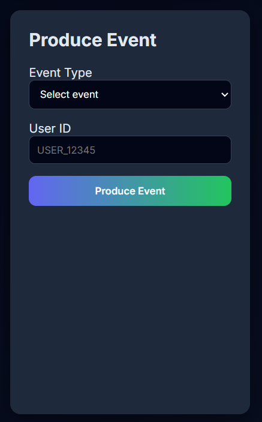
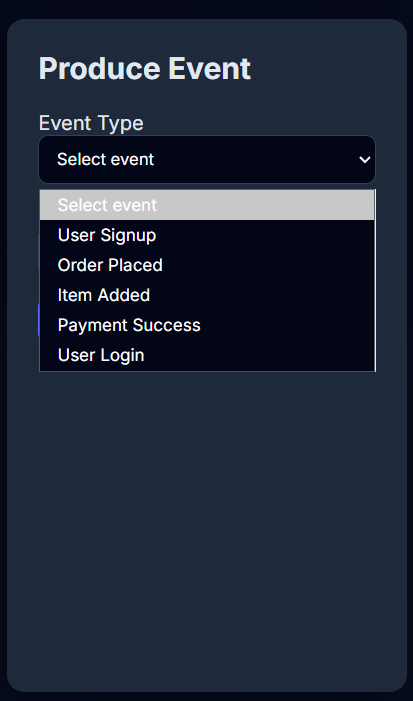
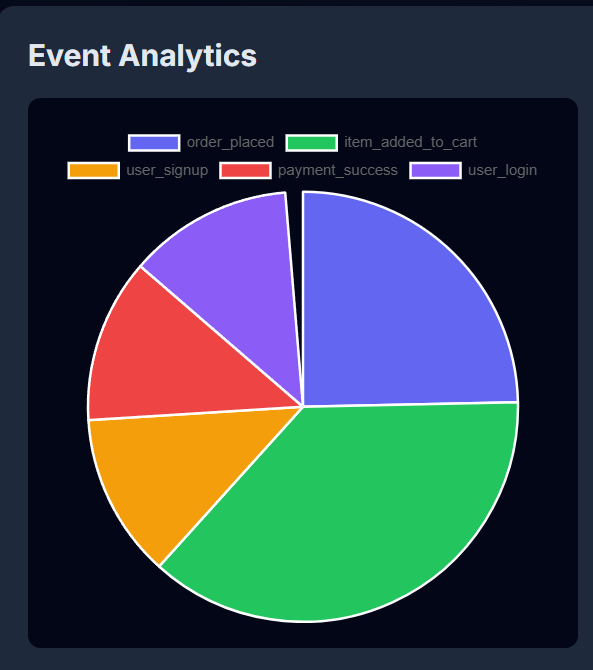
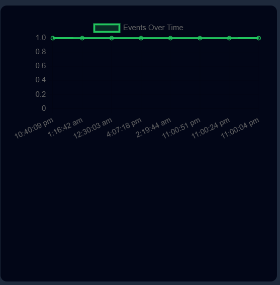
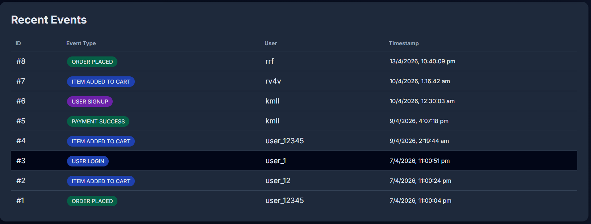

# Kafka Event Logger Dashboard

## Real-Time Event Streaming & Monitoring System
Real-Time Event Streaming & Monitoring System

This project demonstrates a real-time event-driven monitoring system built using Apache Kafka, Node.js, and SQL.

It simulates how modern backend systems collect, process, and analyze events such as user actions, orders, API requests, and system logs.

The system produces events, streams them through Kafka topics, stores them in a database, and displays analytics through a monitoring dashboard.

## Project Overview

Modern distributed systems generate thousands of events per second.
This project shows how event streaming architectures handle these events efficiently.

The system performs the following workflow:

Event producers generate system events.
Events are streamed into Kafka topics.
Kafka consumers process the events.
Processed data is stored in a SQL database.
A dashboard visualizes event analytics.

This architecture is widely used in microservices, observability platforms, and large-scale backend systems.

## System Architecture

Typical event streaming flow:

Event Producer → Kafka Topic → Consumer Service → Database → Monitoring Dashboard

User Action
     ↓
Kafka Producer
     ↓
Kafka Topic
     ↓
Kafka Consumer
     ↓
Database Storage
     ↓
Analytics Dashboard

## Technologies Used

### Backend
Node.js
Express.js
REST API

### Event Streaming
Apache Kafka
Event-driven architecture
Asynchronous event processing

### Database
SQL
PostgreSQL / MySQL
Query optimization

### Monitoring & Observability
API Monitoring
Log Monitoring
System performance tracking
Event analytics dashboard

## Features

Real-time event streaming using Kafka
Backend API for event logging
Event processing with Kafka consumers
Database storage of events
Monitoring dashboard for analytics
Simulated real-world event-driven architecture

## Real-World Use Cases

This architecture is commonly used in:

E-commerce event tracking
Payment processing systems
Microservices communication
System observability platforms
Log analytics platforms
API monitoring systems

## Project Structure

Example structure:

Kafka-Event-Logger-Dashboard
│
├── producer
│   └── eventProducer.js
│
├── consumer
│   └── eventConsumer.js
│
├── server
│   └── app.js
│
├── database
│   └── schema.sql
│
├── dashboard
│   └── monitoring UI
│
└── README.md

## Installation & Setup

1 Install Dependencies
npm install
2 Start Kafka Server
Make sure Kafka and Zookeeper are running.
3 Run Producer
node producer/eventProducer.js
4 Run Consumer
node consumer/eventConsumer.js
5 Start Backend Server
node server/app.js

## Screenshots

###  Dashboard Preview

### Counts

### Event-Form

### Event Analytics

### Recent Events

## Learning Outcomes

Through this project I learned:

Event-driven system architecture
Apache Kafka fundamentals
Real-time data streaming
Backend system monitoring
Debugging distributed systems
SQL event storage and analysis

## Future Improvements

Add Grafana dashboards
Implement alerting system
Add distributed tracing
Deploy using Docker
Add real-time metrics monitoring

## Live links
frontend : https://kafka-event-logger-dashboard-kafka.vercel.app
backend : https://kafka-event-logger-dashboardkafka-event.onrender.com
databse : neon (postgreSQL)

## Author

Srushti Mokshi

MCA Student | Backend Systems | Monitoring & Observability | Event Streaming
